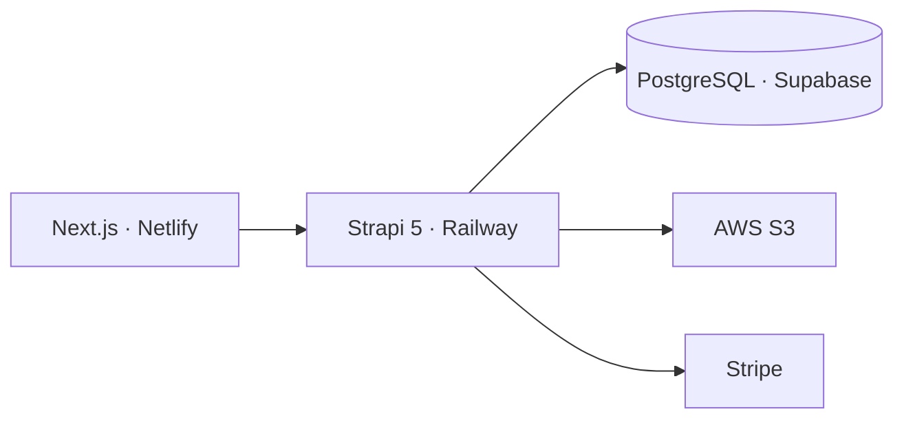

# Gaming Store API

<div align="center">

**Backend de una tienda de videojuegos desarrollado con Strapi 5, PostgreSQL, AWS S3 y Stripe.**

[](https://strapi.io/)
[](https://nodejs.org/)
[](https://www.postgresql.org/)
[](https://railway.com/)

[API en producción](https://ecommerce-strapi-gaming-production.up.railway.app/) · [Repositorio del frontend](https://github.com/ahernandez93/ecommerce-nextjs-gaming)

</div>

## Descripción

Gaming Store API es el backend de una aplicación de comercio electrónico para videojuegos. Proporciona una API REST para administrar usuarios, plataformas, juegos, listas de deseos, direcciones y pedidos, además de procesar pagos mediante Stripe.

El proyecto utiliza Strapi 5 como headless CMS, PostgreSQL alojado en Supabase para la persistencia de datos y AWS S3 para almacenar portadas, imágenes, videos y demás archivos multimedia.

Este repositorio contiene únicamente el **backend**. El frontend se encuentra desarrollado con Next.js App Router, React, Tailwind CSS y shadcn/ui.

## Funcionalidades

- Administración de contenido mediante el panel de Strapi.
- API REST para plataformas y videojuegos.
- Relaciones entre juegos, plataformas, portadas y capturas.
- Registro, inicio de sesión y autenticación mediante JWT.
- Roles y permisos para usuarios públicos y autenticados.
- Gestión de perfiles y actualización de datos del usuario.
- Creación, edición y eliminación de direcciones de envío.
- Lista de deseos asociada al usuario autenticado.
- Procesamiento de pagos mediante Stripe.
- Creación y consulta de pedidos.
- Historial de pedidos ordenado por fecha.
- Archivos multimedia almacenados en AWS S3.
- Base de datos PostgreSQL alojada en Supabase.
- Configuración preparada para desplegar en Railway.

## Tecnologías

| Categoría | Tecnología |
| --- | --- |
| Headless CMS | Strapi 5 |
| Runtime | Node.js |
| Lenguaje | JavaScript |
| API | REST |
| Autenticación | Users & Permissions y JWT |
| Base de datos | PostgreSQL en Supabase |
| Almacenamiento | AWS S3 |
| Pagos | Stripe |
| Despliegue | Railway |
| Gestor de paquetes | pnpm |

## Arquitectura



## Recursos principales

La API administra los siguientes dominios:

| Recurso | Responsabilidad |
| --- | --- |
| Usuarios | Registro, autenticación y perfil |
| Plataformas | Clasificación de juegos por plataforma |
| Juegos | Catálogo, precios, descuentos y contenido multimedia |
| Wishlists | Lista de deseos de cada usuario |
| Direcciones | Direcciones de envío del usuario |
| Pedidos | Productos comprados, dirección, total y fecha |
| Pagos | Validación del carrito, cobro y creación de la orden |

## Instalación local

### Requisitos

- Node.js compatible con la versión definida en `package.json`.
- pnpm.
- Una base de datos PostgreSQL.
- Un bucket de AWS S3 configurado.
- Una cuenta de Stripe con claves de prueba.

### Pasos

1. Clona el repositorio:

   ```bash
   git clone https://github.com/ahernandez93/ecommerce-strapi-gaming
   cd ecommerce-strapi-gaming
   ```

2. Instala las dependencias:

   ```bash
   pnpm install
   ```

3. Crea un archivo `.env` en la raíz del proyecto.

4. Configura las variables de entorno indicadas en la siguiente sección.

5. Inicia Strapi en modo desarrollo:

   ```bash
   pnpm develop
   ```

6. Abre el panel de administración:

   ```text
   http://localhost:1337/admin
   ```

## Variables de entorno

Crea un archivo `.env` utilizando esta estructura:

```env
# Server
HOST=0.0.0.0
PORT=1337

# Strapi secrets
APP_KEYS=key1,key2,key3,key4
API_TOKEN_SALT=REEMPLAZAR
ADMIN_JWT_SECRET=REEMPLAZAR
TRANSFER_TOKEN_SALT=REEMPLAZAR
JWT_SECRET=REEMPLAZAR
ENCRYPTION_KEY=REEMPLAZAR

# PostgreSQL / Supabase
DATABASE_CLIENT=postgres
DATABASE_HOST=REEMPLAZAR
DATABASE_PORT=5432
DATABASE_NAME=postgres
DATABASE_USERNAME=REEMPLAZAR
DATABASE_PASSWORD=REEMPLAZAR
DATABASE_SSL=true
DATABASE_SSL_REJECT_UNAUTHORIZED=false

# AWS S3
AWS_ACCESS_KEY_ID=REEMPLAZAR
AWS_ACCESS_SECRET=REEMPLAZAR
AWS_REGION=REEMPLAZAR
AWS_BUCKET=REEMPLAZAR
AWS_ACL=public-read

# Stripe
STRIPE_SECRET_KEY=sk_test_REEMPLAZAR
```

> Los nombres deben coincidir con los utilizados en los archivos de configuración del proyecto. Nunca subas el archivo `.env` al repositorio.

## Comandos disponibles

| Comando | Descripción |
| --- | --- |
| `pnpm develop` | Inicia Strapi en modo desarrollo |
| `pnpm build` | Compila el panel de administración |
| `pnpm start` | Inicia Strapi en modo producción |
| `pnpm strapi` | Ejecuta comandos de la CLI de Strapi |

## Estructura principal

```text
config/
├── admin.js             # Configuración del panel administrativo
├── database.js          # Conexión con PostgreSQL
├── middlewares.js       # Seguridad, CORS y middlewares
├── plugins.js           # Users & Permissions y AWS S3
└── server.js            # Host, puerto, URL y claves de aplicación

src/
├── api/
│   ├── address/         # Direcciones de envío
│   ├── game/            # Catálogo de videojuegos
│   ├── order/           # Pedidos realizados
│   ├── payment-order/   # Procesamiento de pagos
│   ├── platform/        # Plataformas disponibles
│   └── wishlist/        # Lista de deseos
└── extensions/          # Extensiones de plugins de Strapi
```

La estructura puede variar ligeramente según los nombres utilizados en el proyecto.

## Seguridad del flujo de pago

El backend es responsable de validar toda la información sensible de la compra:

1. Recibe el token de pago, los identificadores de productos, el usuario y la dirección.
2. Consulta los productos directamente desde la base de datos.
3. Recalcula precios, descuentos, cantidades y total.
4. Procesa el cobro utilizando la clave secreta de Stripe.
5. Crea el pedido solamente después de obtener una respuesta válida del proveedor de pagos.

El backend no debe confiar en precios o totales calculados por el navegador.

## Despliegue en Railway

1. Conecta este repositorio a un servicio de Railway.
2. Registra todas las variables de entorno requeridas.
3. Configura los siguientes comandos si Railway no los detecta automáticamente:

   ```text
   Build command: pnpm build
   Start command: pnpm start
   ```

4. Genera un dominio público para el servicio.
5. Registra el dominio público del backend en las variables de entorno del frontend.
6. Si tu configuración CORS restringe los orígenes permitidos, autoriza allí el dominio del frontend en Netlify.

Supabase y AWS S3 mantienen la base de datos y los archivos fuera del sistema de archivos temporal del servicio.

## Buenas prácticas

- Mantén todos los secretos fuera del repositorio.
- Usa claves de Stripe de prueba durante el desarrollo.
- Configura permisos mínimos para los roles Public y Authenticated.
- Valida y sanitiza los datos recibidos en controladores personalizados.
- No expongas claves de AWS, JWT ni Stripe al frontend.
- Utiliza HTTPS en producción.
- Revisa los logs del backend sin registrar tokens, contraseñas o datos de pago.

## Autor

Desarrollado por [Allan Hernández](https://github.com/ahernandez93).

---

<div align="center">
  API desarrollada como práctica de Strapi 5, arquitectura headless e integración con servicios cloud.
</div>
